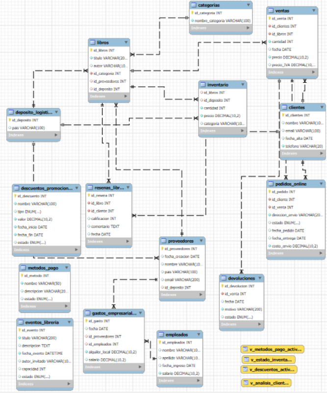

# Proyecto SQL: Librería Petricor

Este proyecto consiste en la creación y gestión de una base de datos para la administración de una librería ficticia llamada **Librería Petricor**. Incluye la definición de tablas, vistas, funciones, procedimientos y triggers, así como la inserción de datos iniciales. A continuación, se detalla la estructura de la base de datos y sus componentes.

## Estructura de la Base de Datos

### 1. Tablas Principales

- **`deposito_logistica`**  
  Almacena información sobre los depósitos logísticos de la librería.
  - `id_deposito` (PRIMARY KEY)
  - `pais`  

- **`proveedores`**  
  Contiene los datos de los proveedores de la librería.
  - `id_proveedores` (PRIMARY KEY)
  - `fecha_creacion` (DEFAULT: fecha actual)
  - `nombre`, `pais`, `email` (UNIQUE)
  - `id_deposito` (FOREIGN KEY)

- **`categorias`**  
  Registra las diferentes categorías de libros disponibles.
  - `id_categoria` (PRIMARY KEY)
  - `nombre_categoria` (UNIQUE)

- **`libros`**  
  Información sobre los libros en la librería.
  - `id_libros` (PRIMARY KEY)
  - `titulo`, `autor`
  - `id_categoria`, `id_proveedores`, `id_deposito` (FOREIGN KEYS)

- **`inventario`**  
  Registro del inventario de libros en los depósitos.
  - `id_libros`, `id_deposito` (FOREIGN KEYS)
  - `cantidad`, `precio`, `categoria`

- **`clientes`**  
  Datos de los clientes de la librería.
  - `id_clientes` (PRIMARY KEY)
  - `nombre`, `email` (UNIQUE), `telefono`
  - `fecha_alta` (DEFAULT: fecha actual)

- **`ventas`**  
  Información sobre las ventas realizadas.
  - `id_venta` (PRIMARY KEY)
  - `id_clientes`, `id_libros` (FOREIGN KEYS)
  - `cantidad` (CHECK > 0), `fecha`, `precio`, `precio_IVA` (calculado)

- **`empleados`**  
  Información del personal que trabaja en la librería.
  - `id_empleados` (PRIMARY KEY)
  - `nombre`, `apellido`, `fecha_ingreso`, `salario` (DEFAULT: 15000)

- **`gastos_empresariales`**  
  Registro de gastos relacionados con la librería.
  - `id_gasto` (PRIMARY KEY)
  - `fecha`, `id_proveedores`, `id_empleados` (FOREIGN KEYS)
  - `alquiler_local`, `salario`

### 2. Tablas Complementarias

- **`descuentos_promociones`**  
  Registro de descuentos y promociones activas o inactivas.
  - `id_descuento` (PRIMARY KEY)
  - `nombre`, `tipo` (ENUM), `valor`, `fecha_inicio`, `fecha_fin`, `estado` (ENUM)

- **`metodos_pago`**  
  Métodos de pago disponibles en la librería.
  - `id_metodo` (PRIMARY KEY)
  - `nombre`, `descripcion`, `estado` (ENUM)

- **`devoluciones`**  
  Control de devoluciones realizadas por los clientes.
  - `id_devolucion` (PRIMARY KEY)
  - `id_venta` (FOREIGN KEY), `fecha`, `motivo`, `estado` (ENUM)

- **`eventos_libreria`**  
  Información sobre eventos organizados por la librería.
  - `id_evento` (PRIMARY KEY)
  - `titulo`, `descripcion`, `fecha_evento`, `autor_invitado`, `capacidad`, `estado` (ENUM)

- **`resenas_libros`**  
  Reseñas y calificaciones de los libros por parte de los clientes.
  - `id_resena` (PRIMARY KEY)
  - `id_libro`, `id_cliente` (FOREIGN KEYS)
  - `calificacion` (CHECK: 1-5), `comentario`, `fecha`

- **`pedidos_online`**  
  Detalles de los pedidos realizados en línea.
  - `id_pedido` (PRIMARY KEY)
  - `id_cliente`, `id_venta` (FOREIGN KEYS)
  - `direccion_envio`, `estado` (ENUM), `fecha_pedido`, `fecha_entrega`, `costo_envio`

## Características Adicionales

1. **Integridad Referencial:** Todas las relaciones están definidas mediante claves foráneas.
2. **Restricciones de Validación:** Uso de restricciones como `CHECK`, valores predeterminados (`DEFAULT`), y enumeraciones (`ENUM`).
3. **Campos Calculados:** Uso de columnas generadas como `precio_IVA` en la tabla de ventas.

## Instrucciones de Uso

1. Clonar el repositorio y abrir el archivo SQL correspondiente.
2. Ejecutar los scripts de creación de la base de datos en el siguiente orden:
   - Crear la base de datos y las tablas.
   - Insertar los datos iniciales con el script `insert_data.sql`.
3. Explorar y gestionar la base de datos mediante un gestor SQL o línea de comandos.

## Futuras Implementaciones

- Incorporación de **triggers** para auditorías automáticas.
- Definición de **vistas** para reportes de ventas y análisis.
- Implementación de **procedimientos almacenados** para operaciones comunes.

